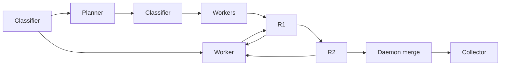

# Quorum

> [!WARNING]
> **Experimental — not ready for production.** Quorum is under active development,
> has sharp edges, and may change its commands, configuration, schemas, and behavior
> without notice. Do not rely on it for production delivery workflows or unattended
> critical repositories.

Quorum is a local Git/GitHub agent pipeline. A repository-local `quorum serve`
daemon owns task lifecycle and uses SQLite as its source of truth; agents provide
implementation, review, and analysis turns, but their messages and signals do
not themselves transition or merge tasks.

The short version is not just `task → worker → review → merge`. A submitted
task can cause several provider calls:



The direct path sends classified work to a worker. Qualifying larger work first
passes through the planner, whose proposed children are classified before they
reach dependency-ordered workers. Blocking findings from either review stage
return the existing Proposed Change to its worker for rework; the updated head
then returns to the responsible review stage.

Some stages run only when their lifecycle conditions or configured policy call
for them: planning/decomposition depends on task classification, rework depends
on review or verification findings, and R2 participation follows review policy.
"Conditional" does not mean every stage has an independent on/off switch in the
current configuration. Collection is part of the current post-merge path;
follow-up activation and doctor work have their own eligibility rules. This
README describes provider consumption, not a guarantee that every task visits
every branch.

Quorum follows my own workflow, assumes
Git, GitHub, local credentials, and capable coding agents, and has sharp edges.
If it is useful to you, great—but there are no compatibility or support
guarantees.

## What it does

One `quorum serve` process manages a repository-local queue. It assesses task
readiness and complexity, schedules dependencies, provisions isolated
worktrees, publishes GitHub PRs, runs independent review stages, and performs
the final merge only after the required gates pass. The daemon is the sole
lifecycle and merge authority: agents can report work or verdicts, but cannot
advance lifecycle by messaging or merge a PR themselves.

The managed capabilities include:

- Atomic lifecycle, claims, and role assignment backed by SQLite; recovery and
  provider retry are durable rather than dependent on a still-running process.
- Classifier-led routing and, for qualifying larger work, dependency-aware
  decomposition into smaller children.
- Isolated worktrees and PR publication for implementation tasks, plus exact-PR
  continuation for `--continue-pr` tasks.
- Sticky implementation/rework continuity: rework is a new turn on the existing
  Proposed Change, rather than a new, unrelated implementation assignment.
- Two independent review stages (R1 and R2), renewed review for a new rework
  head, daemon-owned merge, and post-merge review analytics.
- Local inspection through terminal status and a loopback-only, read-only web
  dashboard; supervised self-update for Quorum's own repository.

Quorum provides bounded coordination, not correctness. It cannot make an agent
correct, recover unavailable credentials, or turn an unclear task into a good
implementation. It is deliberately local Git/GitHub infrastructure, not a
hosted service or a general-purpose workflow system.

## Managed pipeline

1. **Intake and classification.** The daemon sends submitted work through a
   classifier assessment before worker dispatch. The classifier supplies
   complexity (1–5), execution size (S/M/L/XL), readiness, and duplicate hints.
   It can operate on a bounded batch of tasks.
2. **Conditional decomposition.** A ready, non-review-only, non-continuation
   L or XL task classified at complexity 4 or 5 may enter the planner path.
   The planner proposes a closed, dependency-ordered DAG of independently
   deliverable S/M children. Quorum classifies the proposed children before
   materializing the graph; planning can instead hold for a blocker or retry
   within its bounded policy. Smaller or otherwise direct-routed tasks skip
   this stage.
3. **Implementation and publication.** A worker receives an execution-ready
   task in an isolated worktree, implements it, verifies it, and publishes or
   updates the PR. A `--continue-pr` task starts from the recorded PR head.
4. **Independent review.** R1 reviews the PR head. Required R2 then has its
   own allocation and review responsibility; the safe default makes R2
   mandatory, while deterministic R2 sampling can be configured for later
   steady-state coverage. Neither reviewer is the author or merge authority.
5. **Rework and renewed review.** Blocking review feedback returns the same
   Proposed Change to a rework turn. The reviewer responsible for the changes
   verdict re-reviews the updated head in that same stage: R1 resumes R1, while
   R2-originated rework resumes R2 directly rather than restarting at R1. For a
   review-only task with no managed worker, the daemon provisions a remediation
   worker. Prior approval is not reused for changed code.
6. **Merge and collection.** Once the daemon has the required approvals and
   merge gates, it performs the merge. A detached collector then records
   post-merge review analytics. Collection failures are visible and have a
   bounded retry path. Qualifying, evidence-backed follow-up material is
   prepared for the separately bounded follow-up-planning path when that path
   is activated; it never reopens the merged task.
7. **Optional troubleshooting.** When enabled, a one-shot doctor turn can
   investigate a stalled task with no active worker or reviewer. It reports
   evidence; it does not take lifecycle authority.

Review-only tasks (`--review-pr`) intentionally skip initial managed
implementation. If blocking feedback requires code changes, the daemon enters
rework and provisions managed remediation for the existing PR.

## Managed roles

These roles are responsibilities selected and supervised by the daemon, not
independent authorities:

- **Classifier** assesses task complexity, execution size, readiness, and
  duplicate hints; it also assesses proposed decomposition children.
- **Planner** turns a qualifying large outcome into a bounded dependency DAG of
  S/M children or records why it cannot safely split it.
- **Worker** implements and publishes the Proposed Change; its rework turns
  continue that same change.
- **R1** performs the first independent review of a PR head.
- **R2** performs a separately assigned second review when the review policy
  requires it; it is not an extension of the worker or R1 session.
- **Collector** performs post-merge, analytics-only extraction of review
  findings and possible follow-up material.
- **Doctor** is optional, off by default, and only troubleshoots an eligible
  stalled task.

The daemon alone applies lifecycle transitions, formal review disposition, and
merge. Provider output, agent messages, and task notes are inputs or evidence,
not lifecycle commands.

## Models and weighted routing

`quorum serve` reads reusable `[model_profiles]` that bind a provider runner,
model, and effort, then assigns those profiles through role-specific routing
pools. Claude and Codex are enabled for their configured managed roles; Grok
Build is enabled only for managed worker pools. Planner, reviewer, classifier,
and collector routing remain non-Grok.

The complete vocabulary and a production-shaped policy are in
[`docs/serve-config.example.toml`](docs/serve-config.example.toml). This is a
representative excerpt, not a complete serve configuration:

```toml
[model_profiles.terra]
runner = "codex"
model = "gpt-5.6-terra"
effort = "high"

[model_profiles.opus]
runner = "claude"
model = "claude-opus-4-8"
effort = "high"

[routing.classifier]
terra = 100
[routing.planner]
opus = 100
[routing.collector]
terra = 100
[routing.worker.3]
terra = 80
opus = 20
[routing.reviewer.3]
terra = 80
opus = 20
```

Configuration requires pools for classifier, planner, collector, workers at
complexities 1–5, and reviewers at complexities 1–5. Every referenced profile
must be valid for its runner, every weight must be positive, and each pool must
total exactly 100. The planner pool currently accepts Claude profiles; the
complete example reflects that constraint.

Weights are not independent per-call randomness. For each pool Quorum builds a
shuffled, durable 100-slot assignment epoch containing the configured number of
each profile, then atomically advances a cursor as it creates assignments. That
makes the allocation restart-safe and preserves the intended distribution per
epoch. R1 and R2 share the reviewer policy but use separate persisted assignment
bags, so one stage does not consume the other's allocation sequence.

## Where tokens are spent

Treat a submitted task as a pipeline of provider turns, not as one worker
session. Even with no rework, it can spend tokens on the intake classifier, an
optional planner and classifiers for proposed children, implementation, R1, R2,
the post-merge collector, and qualifying follow-up planning when activated.
Provider retries and an optional doctor turn can add further calls. A decomposed
parent can also produce several child implementation and review paths.

Set token, USD, and wall-clock ceilings in the
[serve configuration](docs/serve-config.example.toml); the exact flags are also
listed by `quorum serve --help`. Do not assume every auxiliary role is covered
by a single worker-task budget: classifier, planner, collector, follow-up, and
doctor work are distinct managed responsibilities. Inspect live work with
`quorum status` or `quorum web`, individual task/run details with
`quorum task-get --task-id <N>`, and aggregate terminal-task reporting with
`quorum perf [--by complexity|reviewer]`.

## Install

Prebuilt binary on macOS or Linux:

```sh
curl -fsSL https://raw.githubusercontent.com/ag2trust/quorum/main/install.sh | sh
quorum init
```

Or build it:

```sh
cargo build --release
cp target/release/quorum ~/.local/bin/
quorum init
```

For the initial self-hostable container image, including its persistence and
provider packaging contract, see [`docker/README.md`](docker/README.md). It is
an image/runtime foundation, not a completed hosted service.

State lives under `~/.quorum/repos/<owner>__<name>/`.

## Start it

For a normal repository:

```sh
quorum serve \
  --repo owner/name \
  --repo-dir /path/to/repo \
  --worktree-base /path/to/worktrees
```

Use `quorum serve --help` for provider, model, concurrency, troubleshooting,
and budget settings. This repo uses `scripts/serve-supervisor.sh` so Quorum can
rebuild and restart after updating itself. Only one daemon can manage a
repository database at a time.

## Give it work

There are three task entry modes.

Start a new implementation from the configured base branch:

```sh
quorum task-create \
  --created-by coordinator \
  --title "Add retry telemetry" \
  --body-stdin <<'EOF'
Record retry counts in the status JSON and cover the failure path.
EOF
```

Continue work on the exact current head of an existing PR:

```sh
quorum task-create \
  --created-by coordinator \
  --title "Finish PR #412" \
  --continue-pr 412 \
  --body-stdin <<'EOF'
Finish the implementation and verify the complete result.
EOF
```

Review and merge a PR whose implementation is already complete:

```sh
quorum task-create \
  --created-by coordinator \
  --title "Review PR #412" \
  --review-pr 412 \
  --body-stdin <<'EOF'
Review the existing implementation and merge it if it is sound.
EOF
```

`--continue-pr` creates a managed worker from the recorded PR head. `--review-pr` skips the
initial worker and starts with review. They are mutually exclusive. If a review-only PR
receives blocking feedback, the daemon enters rework and provisions a managed remediation
worker for that existing PR.

Give implementation tasks a concrete outcome, relevant constraints, and a way to verify
the result. The daemon chooses complexity, model, and effort. Managed agents receive their
assignment directly; they do not poll or claim tasks.

## See what is happening

```sh
quorum status                 # terminal overview
quorum web                    # loopback-only, read-only dashboard
quorum task-list --brief      # queue summary
quorum task-get --task-id 42  # full task and notes
quorum log --refs task#42     # lifecycle events
quorum tail Agent-42          # one managed session
quorum perf --by complexity   # terminal-task performance aggregates
```

Use `quorum <command> --help` for exact flags and `quorum help` for the current workflow.
Most commands emit JSON. Exit codes are `0` for success, `1` for an expected negative
result, `2` for bad input, and `3` for an internal or database failure.

## Active work / roadmap

This is a non-binding view of ongoing directions, not a release schedule:

- Grok Build worker routing is active; the managed worker model is currently
  pinned to `grok-4.5`; attended real-CLI worker and lifecycle canaries remain
  required before production use.
- Continuity for turn-oriented runners is being matured, including sticky and
  dormant execution states.
- Provider failover across eligible routing alternatives and durable per-task
  base branches are active design directions.
- Qualifying, evidence-backed review follow-ups have bounded planning and
  storage foundations; their lifecycle activation remains separate work.
- The self-hostable container/runtime foundation is being matured; it is not a
  hosted Quorum service.
- The existing loopback-only, read-only web dashboard may expand as local
  inspection needs are proven, while retaining its local, read-only posture.

## Working on Quorum

Contributor and agent instructions live in [`AGENTS.md`](AGENTS.md). The design record is
[`docs/2026-06-23-quorum-design.md`](docs/2026-06-23-quorum-design.md). Run the full gate
before submitting any change:

```sh
rtk proxy ./preflight.sh
```

The required suite includes one real-process SQLite smoke race per contention
path. To run the full repeated contention depth on demand, use:

```sh
scripts/stress-process-canaries.sh
```

## License

MIT — see [`LICENSE`](LICENSE).
